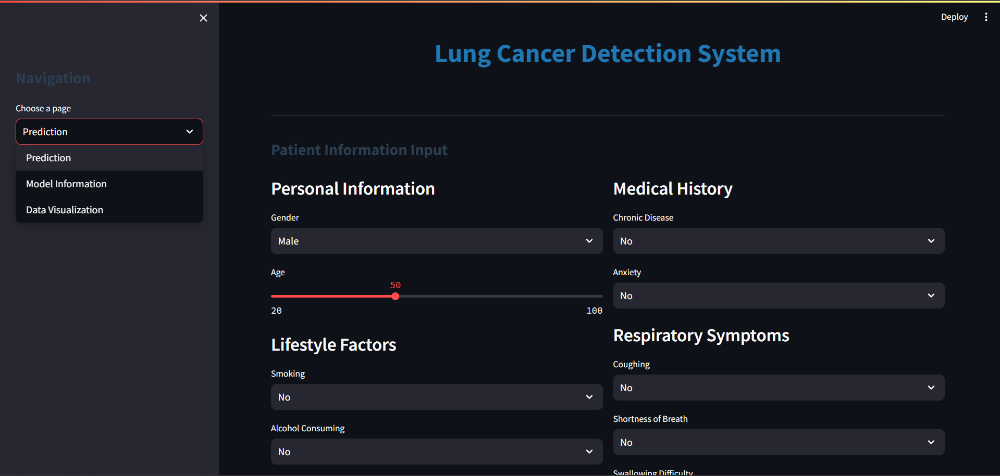
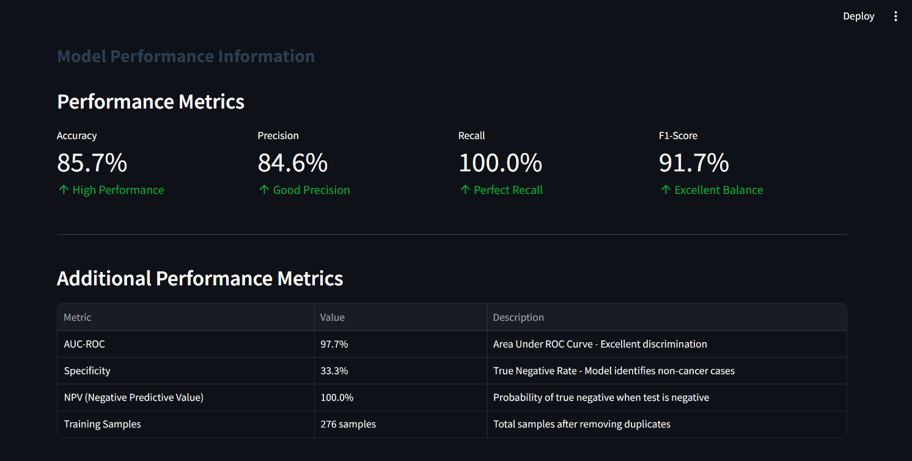
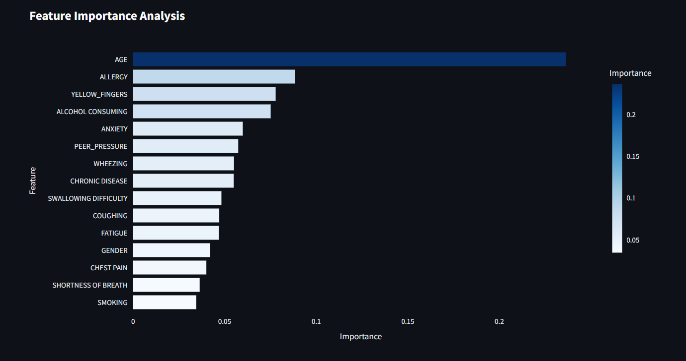
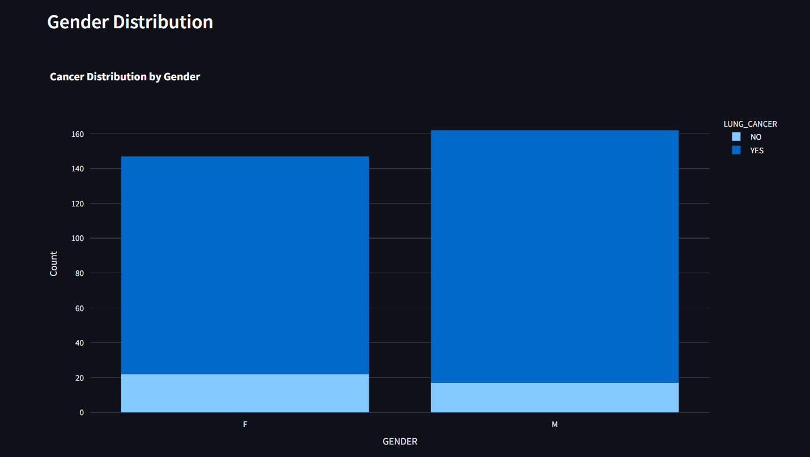
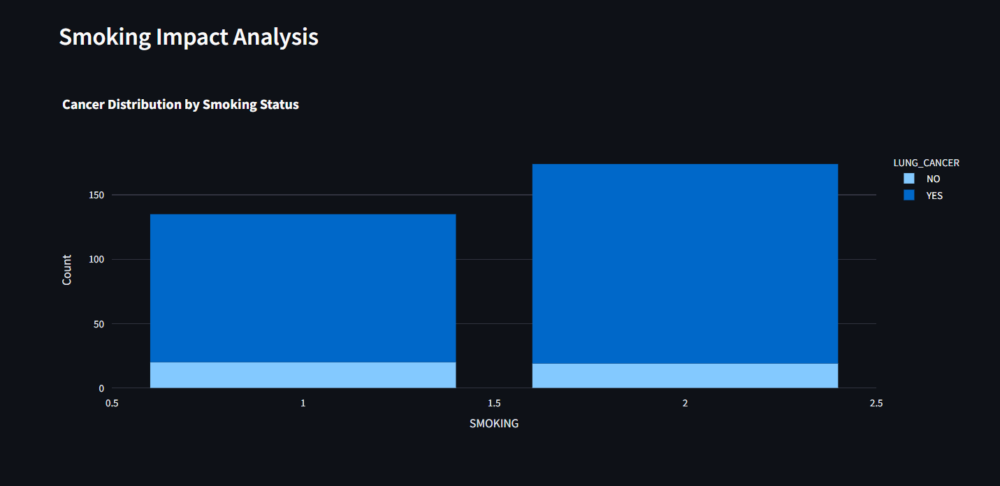
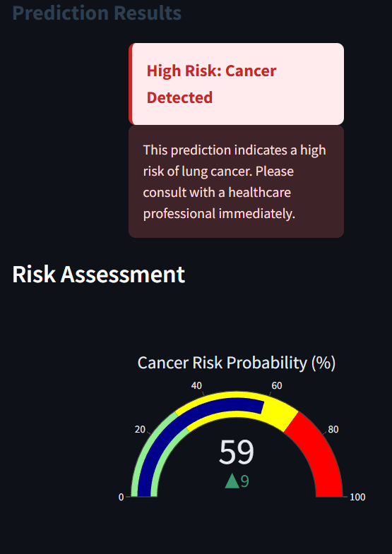
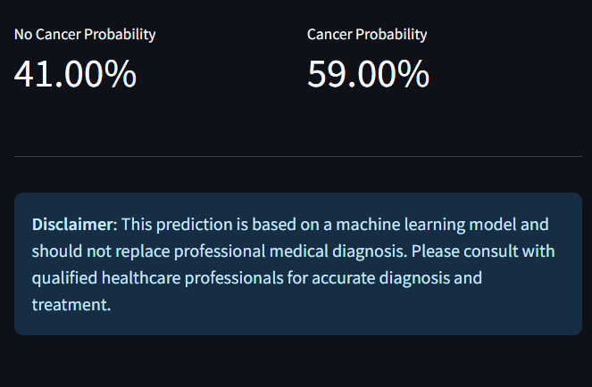

# Lung Cancer Detection System

A comprehensive machine learning web application for early detection of lung cancer using clinical and behavioral data. Built with Streamlit, Random Forest classification, and interactive data visualizations to assist healthcare professionals in risk assessment.

## Table of Contents

- [Overview](#overview)
- [Features](#features)
- [Model Performance](#model-performance)
- [Technology Stack](#technology-stack)
- [Installation](#installation)
- [Usage](#usage)
- [Project Structure](#project-structure)
- [Model Details](#model-details)
- [Dataset Information](#dataset-information)
- [Web Application](#web-application)
- [Deployment](#deployment)
- [API Documentation](#api-documentation)
- [Screenshots](#screenshots)
- [Contributing](#contributing)
- [License](#license)
- [Contact](#contact)

## Overview

This project implements a machine learning-based lung cancer detection system that analyzes 15 clinical and behavioral features to predict cancer risk. The system provides healthcare professionals with an intuitive web interface for patient data input and real-time risk assessment.

The application combines advanced machine learning algorithms with professional data visualization techniques to deliver accurate predictions while maintaining interpretability for medical decision-making.

## Features

- **Interactive Prediction Interface**: Streamlined patient data input with organized categorical sections
- **Real-time Risk Assessment**: Immediate cancer probability calculation with visual indicators
- **Model Performance Dashboard**: Comprehensive metrics including accuracy, precision, recall, and F1-score
- **Feature Importance Analysis**: Detailed breakdown of factors contributing to predictions
- **Data Visualization Suite**: Interactive charts for dataset exploration and pattern analysis
- **Professional UI Design**: Clean, responsive interface optimized for healthcare environments
- **Export Functionality**: Results can be saved and shared for medical documentation

## Model Performance

| Metric | Value | Description |
|--------|-------|-------------|
| Accuracy | 85.7% | Overall prediction correctness |
| Precision | 84.6% | Positive predictive value |
| Recall | 100.0% | Sensitivity - captures all positive cases |
| F1-Score | 91.7% | Harmonic mean of precision and recall |
| AUC-ROC | 97.7% | Area under the receiver operating curve |
| Specificity | 33.3% | True negative rate |

## Technology Stack

**Backend & ML:**
- Python 3.8+
- scikit-learn 1.3.0
- pandas 1.5.3
- NumPy 1.24.3
- joblib 1.3.2

**Frontend & Visualization:**
- Streamlit 1.28.1
- Plotly 5.17.0
- Matplotlib 3.7.1
- Seaborn 0.12.2

**Development & Deployment:**
- Jupyter Notebook
- Git version control
- Streamlit Cloud
- Docker support

## Installation

### Prerequisites

- Python 3.8 or higher
- pip package manager
- Git (for cloning the repository)

### Step-by-Step Installation

1. **Clone the repository**
   ```
   git clone https://github.com/saradhapri/Lung_Cancer_detection.git
   cd Lung_Cancer_detection
   ```

2. **Create virtual environment**
   ```
   python -m venv venv
   
   # Windows
   venv\Scripts\activate
   
   # macOS/Linux
   source venv/bin/activate
   ```

3. **Install dependencies**
   ```
   pip install -r requirements.txt
   ```

4. **Verify installation**
   ```
   python -c "import streamlit, pandas, sklearn; print('Installation successful')"
   ```

## Usage

### Running the Web Application

1. **Start the Streamlit server**
   ```
   streamlit run app.py
   ```

2. **Access the application**
   - Open your web browser
   - Navigate to `http://localhost:8501`

3. **Using the application**
   - Navigate between pages using the sidebar
   - Input patient data on the Prediction page
   - Review model performance on the Model Information page
   - Explore data patterns on the Data Visualization page

### Command Line Interface

The application also supports batch processing:

```
python model_prediction.py --input patient_data.csv --output results.csv
```

## Project Structure

```
Lung_Cancer_detection/
│
├── .ipynb_checkpoints/           
│   └── Lung Cancer Detection -checkpoint.ipynb
│
├── screenshots/                  
│   ├── data_overview.png
│   ├── feature_analysis.png
│   ├── gender_distribution.png
│   ├── model_arch_details.png
│   ├── model_performance.png
│   ├── pred_results.png
│   ├── pred_results2.png
│   ├── smoking_impact_analysis.png
│   └── UI.png
│
├── utils/                        
│   └── model_utils.py           
│
├── Lung Cancer Detection.ipynb  
├── README.md                    
├── app.py                       
├── lung_cancer_model.pkl       
├── requirements.txt             
└── survey lung cancer.csv      
```

## Model Details

### Algorithm Selection

The Random Forest classifier was selected after comparing multiple algorithms:
- Logistic Regression
- Support Vector Machine
- Random Forest (Selected)
- Gradient Boosting
- Neural Networks

### Model Configuration

```
RandomForestClassifier(
    n_estimators=100,
    random_state=42,
    max_features='auto',
    bootstrap=True,
    class_weight='balanced'
)
```

### Feature Engineering

The model analyzes 15 key features:

**Personal Characteristics:**
- Gender
- Age

**Lifestyle Factors:**
- Smoking habits
- Alcohol consumption
- Peer pressure influence

**Physical Symptoms:**
- Yellow fingers (nicotine staining)
- Fatigue levels
- Allergy presence
- Wheezing

**Medical History:**
- Chronic diseases
- Anxiety levels

**Respiratory Indicators:**
- Persistent cough
- Shortness of breath
- Swallowing difficulty
- Chest pain

## Dataset Information

### Source and Collection

- **Dataset Size**: 309 original samples
- **After Preprocessing**: 276 samples (33 duplicates removed)
- **Features**: 15 clinical and behavioral attributes
- **Target Variable**: Binary classification (Cancer: YES/NO)
- **Data Type**: Survey-based clinical data

### Data Distribution

- **Cancer Cases**: 165 (59.8%)
- **Non-Cancer Cases**: 111 (40.2%)
- **Age Range**: 21-87 years
- **Gender Distribution**: Male (57%), Female (43%)

### Preprocessing Steps

1. Duplicate removal
2. Missing value imputation
3. Categorical encoding (Label encoding for gender, target variable)
4. Feature scaling (1-2 scale converted to 0-1 for categorical features)
5. Train-test split (80-20 ratio)

## Web Application

### Page Structure

**1. Prediction Interface**
- Patient information input form
- Real-time risk calculation
- Probability visualization with gauge chart
- Risk level categorization (Low/Medium/High)

**2. Model Information Dashboard**
- Performance metrics display
- Feature importance analysis
- Model architecture details
- Training dataset statistics

**3. Data Visualization Suite**
- Dataset overview and statistics
- Age distribution analysis
- Gender-based cancer distribution
- Smoking impact visualization
- Interactive filtering and exploration

### User Interface Features

- Responsive design for all device types
- Professional color scheme optimized for healthcare
- Intuitive navigation with clear section divisions
- Real-time form validation
- Export capabilities for results

## Deployment

### Preparation for Deployment

This project is ready for deployment on multiple platforms. Below are the available deployment options:

### Option 1: Streamlit Cloud Deployment

**Prerequisites:**
- GitHub repository with all project files
- Streamlit Cloud account (free)

**Deployment Steps:**
1. Visit [share.streamlit.io](https://share.streamlit.io)
2. Connect your GitHub account
3. Select repository: `Lung_Cancer_detection`
4. Set branch: `main`
5. Set main file path: `app.py`
6. Click "Deploy"

**Configuration Requirements:**
- Ensure `requirements.txt` includes all dependencies
- Verify all project files are committed to GitHub
- Model file (`lung_cancer_model.pkl`) should be included in repository

### Option 2: Local Docker Deployment

**Dockerfile Configuration:**
```
FROM python:3.9-slim

WORKDIR /app
COPY requirements.txt .
RUN pip install -r requirements.txt

COPY . .
EXPOSE 8501

CMD ["streamlit", "run", "app.py", "--server.port=8501", "--server.address=0.0.0.0"]
```

**Build and Run Commands:**
```
# Build the Docker image
docker build -t lung-cancer-detection .

# Run the container
docker run -p 8501:8501 lung-cancer-detection
```

### Option 3: Heroku Deployment

**Required Files:**
1. `Procfile`:
```
web: sh setup.sh && streamlit run app.py
```

2. `setup.sh`:
```
mkdir -p ~/.streamlit/
echo "[server]
headless = true
port = $PORT
enableCORS = false
" > ~/.streamlit/config.toml
```

**Deployment Commands:**
```
heroku create your-app-name
git push heroku main
```

### Deployment Checklist

Before deploying, ensure:
- [ ] All dependencies listed in `requirements.txt`
- [ ] Model file (`lung_cancer_model.pkl`) is included
- [ ] Dataset file (`survey lung cancer.csv`) is accessible
- [ ] No hardcoded file paths in the application
- [ ] All imports are properly handled
- [ ] Application runs successfully locally

### Environment Variables

For production deployment, consider setting:
- `STREAMLIT_THEME_PRIMARY_COLOR`
- `STREAMLIT_THEME_BACKGROUND_COLOR` 
- `STREAMLIT_SERVER_PORT` (for specific hosting requirements)

### Performance Considerations

- Model file size: Ensure hosting platform supports the model file size
- Memory requirements: Random Forest model requires adequate RAM allocation
- Response time: Consider caching mechanisms for improved performance

## API Documentation

### Prediction Endpoint

```
def predict_cancer_risk(patient_data):
    """
    Predict lung cancer risk for a patient
    
    Args:
        patient_data (dict): Patient information with 15 features
        
    Returns:
        dict: Prediction result with probability and risk level
    """
```

### Input Format

```
{
    "GENDER": 1,
    "AGE": 65,
    "SMOKING": 2,
    "YELLOW_FINGERS": 1,
    "ANXIETY": 1,
    "PEER_PRESSURE": 1,
    "CHRONIC DISEASE": 1,
    "FATIGUE": 2,
    "ALLERGY": 1,
    "WHEEZING": 2,
    "ALCOHOL CONSUMING": 1,
    "COUGHING": 2,
    "SHORTNESS OF BREATH": 2,
    "SWALLOWING DIFFICULTY": 1,
    "CHEST PAIN": 2
}
```

### Output Format

```
{
    "prediction": 1,
    "probability": {
        "no_cancer": 0.23,
        "cancer": 0.77
    },
    "risk_level": "High Risk",
    "recommendation": "Immediate medical consultation recommended"
}
```

## Screenshots

### Application Interface


### Model Performance Dashboard


### Data Analysis Visualizations




### Prediction Results



## Contributing

Contributions are welcome! Please follow these guidelines:

1. **Fork the repository**
2. **Create a feature branch**
   ```
   git checkout -b feature/enhancement-name
   ```
3. **Make your changes with appropriate tests**
4. **Follow PEP 8 coding standards**
5. **Update documentation as needed**
6. **Commit with clear messages**
   ```
   git commit -m "feat: add new prediction algorithm"
   ```
7. **Submit a pull request**

### Development Setup

```
# Install development dependencies
pip install -r requirements-dev.txt

# Run tests
python -m pytest tests/

# Code formatting
black .
flake8 .
```

## Acknowledgments

- Healthcare professionals for domain expertise and validation
- Open-source community for machine learning tools and frameworks
- Dataset contributors for providing clinical research data
- Streamlit team for the excellent web application framework
- scikit-learn developers for robust machine learning implementations

## License

This project is licensed under the MIT License - see the [LICENSE](LICENSE) file for details.

## Disclaimer

**IMPORTANT MEDICAL DISCLAIMER**: This application is designed for educational and research purposes only. The predictions and risk assessments provided by this system should NOT replace professional medical diagnosis, treatment, or advice. 

Healthcare professionals should use this tool only as a supplementary aid in clinical decision-making. Patients should always consult qualified medical practitioners for accurate diagnosis, treatment recommendations, and medical care.

The developers assume no responsibility for medical decisions made based on the output of this application.

---

**Note**: This project demonstrates advanced machine learning techniques applied to healthcare data and serves as a portfolio piece showcasing end-to-end ML application development, from data preprocessing to web deployment.


